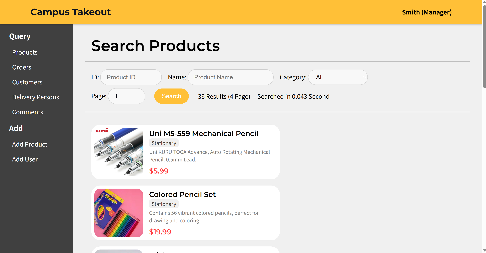
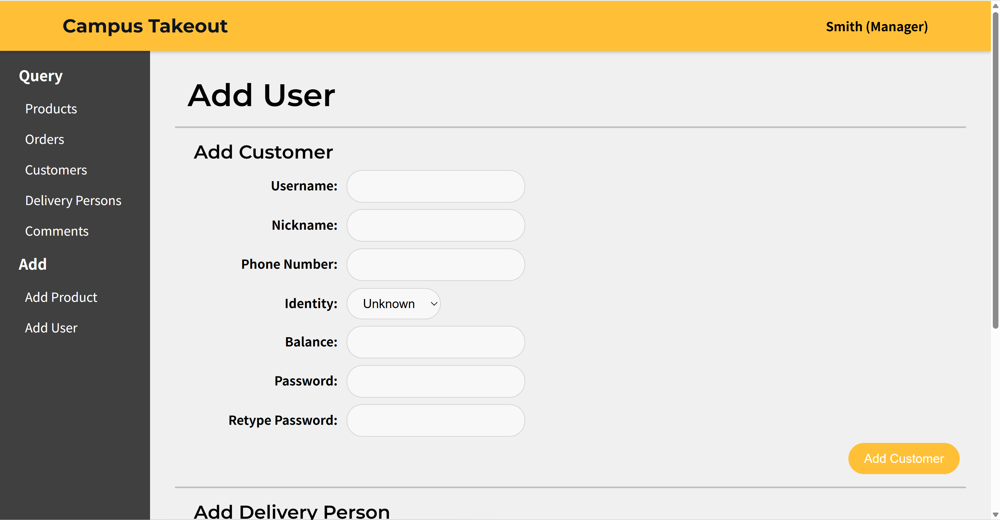
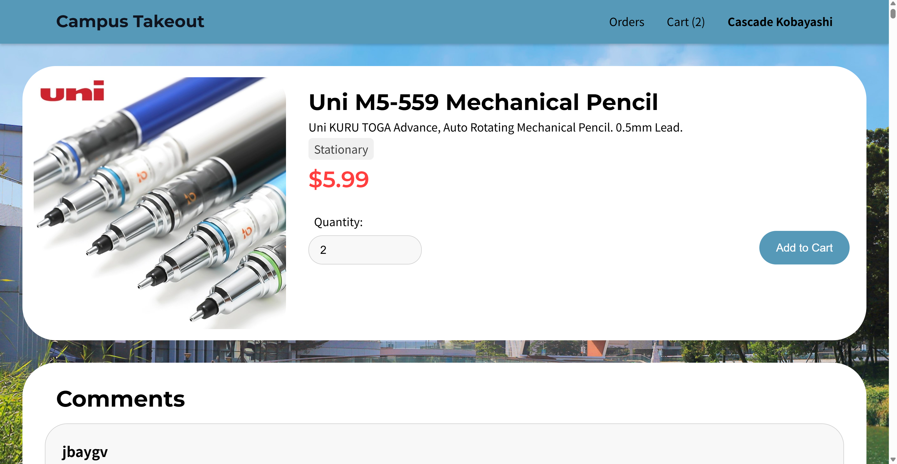
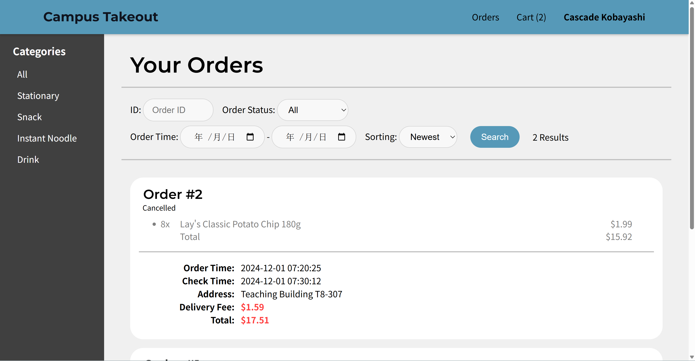
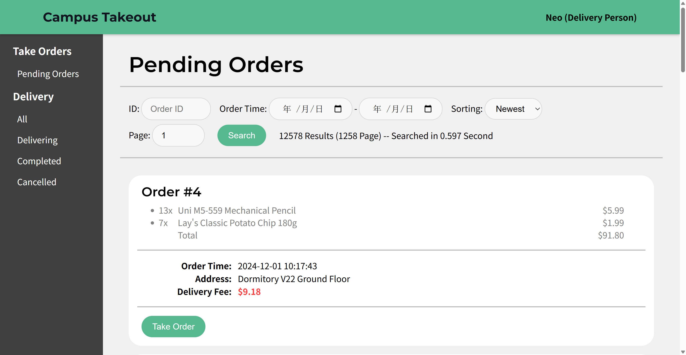
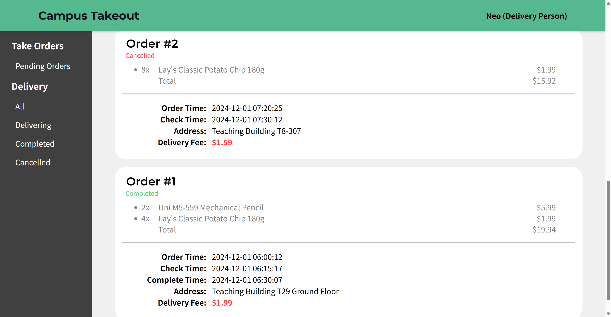

# UIC Takeout Platform - DBMS Project

---

***Database Management System***

## 📌 Overview  
The **UIC Takeout Platform** is a database-driven food delivery management system designed to streamline interactions between customers, managers, and delivery personnel. This project was developed as part of a Database Management Systems (DBMS) course, focusing on efficient data handling, user-friendly interfaces, and secure system operations.

## 🎯 Project Background  
Delivery services play a significant role in today's fast-paced world. A well-designed management system can enhance customer experience and operational efficiency. This platform aims to simplify interactions between users and administrators, providing a seamless experience for all stakeholders.

---

## 🧩 Features

### 👨‍💼 **Manager**  
- Query products, orders, customers, delivery personnel, and comments  
- Add new products and users

### 🛒 **Customer**  
- Add items to cart  
- Place orders  
- Submit comments and feedback

### 🚴 **Delivery Personnel**  
- Accept and manage orders  
- Update delivery status

---

## 🗃️ Database Design  

### ER Diagram  
Designed by **LIN Tingheng** to represent relationships between entities such as:  
- User (Customer, Delivery Person, Manager)  
- Product, Category, Cart, Order, Transaction, Comment  

### Foreign Key Relationships  
The database enforces referential integrity through foreign keys linking:  
- User → Customer / Delivery Person  
- Order → Product / Transaction  
- Comment → Product / User  

---

## ⚙️ Technical Highlights  

### 🖼️ **BLOB for Image Storage**  
- Used `LONGBLOB` (up to 4GB) to store product images directly in the database instead of file paths.

### 🔁 **Triggers for Constraints**  
- Implemented triggers like `add_user` to automatically synchronize data into subtables (customer/delivery person) based on user type.  
- Applied check constraints and delete cascading for data consistency.

### 🔒 **Secure Connection Handling**  
- Every `.php` file validates user type after session start.  
- Invalid sessions are destroyed, and users are redirected to the login page for security.

---

## 🛠️ Installation & Setup  

### Prerequisites  
- MySQL Database  
- PHP-enabled web server XAMPP
- Web browser  

### Steps  
1. Clone the repository or download source files.  
2. Import the provided SQL file into MySQL.  
3. Configure database connection settings in the PHP files.  
4. Deploy files to your web server directory.  
5. Access the platform via `localhost/<project-folder>`.
